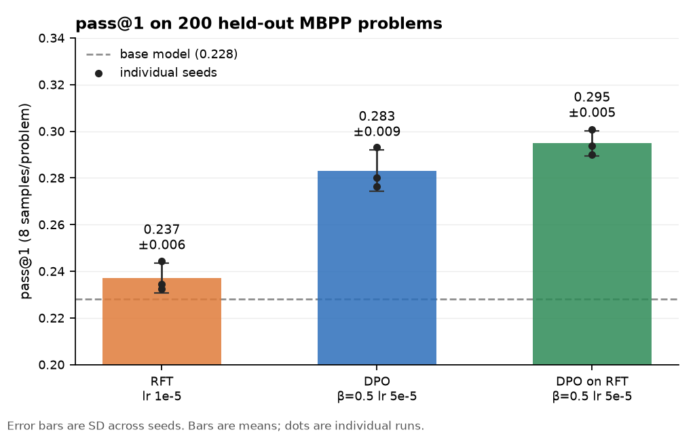

# cargocult — execution-verified preference optimization for code generation

> *Cargo-cult programming: code that imitates the form of a correct solution
> without the substance. A 0.5B model writes syntactically perfect Python that
> doesn't run. This project replaces that with a signal that can tell the
> difference.*

Qwen2.5-0.5B-Instruct is made better at writing correct Python using **program
execution as the only reward** — no human preference labels, no LLM judge. Two
methods are compared under one harness: **DPO**, trained on the contrast
between a passing and a failing sample, and **RFT** (rejection-sampling
fine-tuning), trained on the passing samples alone. The question is whether
DPO's use of negative samples buys anything over simply training on positives,
at 0.5B scale.

**It does — about 4.6 points of pass@1 — and RFT does not reliably beat the
base model at all. Running RFT first and DPO on top of it is better still.**
From-scratch DPO with LoRA on a 4 GB laptop GPU, 3 seeds per arm, evaluated on
200 held-out MBPP problems with the unbiased pass@k estimator.

| arm | pass@1 (mean ± SD, 3 seeds) | vs base | z |
|---|---|---|---|
| Qwen2.5-0.5B-Instruct (base) | 0.2281 | — | — |
| RFT, lr 1e-5 | 0.2371 ± 0.0064 | +0.0090 | 1.15 (ns) |
| DPO, β=0.5, lr 5e-5 | 0.2831 ± 0.0089 | +0.0550 | 4.85 |
| **DPO on top of RFT** | **0.2948 ± 0.0054** | **+0.0667** | **5.48** |



Paired per problem, pooling seeds:

| comparison | difference | z | seed-level t(4) |
|---|---|---|---|
| DPO vs RFT | +0.0460 ± 0.0097 | 4.73 | 7.30 |
| sequential vs RFT | +0.0577 ± 0.0104 | 5.53 | 11.96 |
| sequential vs DPO | +0.0117 ± 0.0053 | 2.20 | **1.95 (ns)** |
| RFT vs base | +0.0090 ± 0.0078 | 1.15 (ns) | — |

Read that last column. **The sequential recipe is the best arm, but its
increment over plain DPO is not established** — it clears significance per
problem and fails it per seed (t = 1.95 against a critical 2.78), which with
three seeds and a 1.2-point effect is what underpowered looks like. The claims
that survive both tests are DPO over RFT, and everything over base except RFT
itself.

pass@8 moves much less: 0.4717 (DPO) against 0.4600 (base). The gain is
concentrated in making the *first* sample more likely to be right, not in
expanding what the model can eventually reach.

---

## Method

**Reward.** Each sampled completion is executed in a subprocess sandbox against
MBPP's three asserts, run one at a time so partial credit is real. The reward
is a ladder rather than a boolean, because at 0.5B a pass/fail signal is nearly
constant: 0.0 if it does not parse, 0.10 if it parses, 0.30 if it runs, then
0.30 → 1.00 in the fraction of asserts passed, with −0.10 for hitting the token
limit without emitting EOS.

**Data.** 374 MBPP training problems × 16 samples at temperature 1.0, top_p
1.0 — 5,984 completions, all executed and scored. Pairs take a full-pass
completion as `chosen` and a failing one as `rejected`, filtered on reward
margin and near-duplicate edit distance, capped at 6 per problem: **1,080
pairs from 180 problems**. RFT trains on the 1,075 distinct passing
completions.

**Loss.** DPO (Rafailov et al., 2023) — the log-sigmoid of the margin between
how much more the policy prefers `chosen` over `rejected` than the reference
does:

```
L = -log σ( β · [ (log π_θ(c|x) - log π_ref(c|x)) - (log π_θ(l|x) - log π_ref(l|x)) ] )
```

Log-probabilities are summed over completion tokens only, never the prompt.
The **reference model is the same weights with the LoRA adapter disabled**,
which is what makes DPO fit in 4 GB — there is no second model in memory.

**Training.** LoRA r=16, α=32 on all seven projections (~8.8M trainable of
503M), bf16, batch 1 pair with gradient accumulation to 8, gradient
checkpointing, cosine schedule. Peak 2.3 GB, inside the 3.0 GB target.

**Seeds shuffle the data, not just the initialisation.** This is worth stating
because it was wrong first. `--seed` originally varied only LoRA
initialisation and dropout while every run walked the corpus in file order, so
the three "seeds" shared a data ordering and the SD across them would have
understated real run-to-run variance — in precisely the number this README
leads with. Seeds now shuffle the pair ordering as well, and the reported means
come from runs redone under that recipe.

**Evaluation.** Unbiased pass@k — `1 - C(n-c,k)/C(n,k)`, not "did any of k
samples pass", which is biased upward when n > k. Two tiers: dev (90 problems ×
4) for iteration, full (200 × 8, drawn from the test split) for candidates.
Checkpoints are selected on dev and reported on full, so selection and
measurement never share problems.

---

## Findings

The numbers above are the smaller half of what this project produced. Three
findings about *how* it produced them are more useful.

### 1. The sweep protocol ranked the winning configuration last

The plan was to move one hyperparameter axis at a time from β=0.1, lr=1e-5 —
standard practice, and cheaper than a grid. Seven dev-tier runs later, nothing
cleared noise: the best was +0.033 at z = 1.33, and RFT matched every DPO run.
The honest conclusion at that point was a negative result.

It was wrong, for two compounding reasons.

**The dev tier could not have detected the effect.** 90 problems gives a paired
standard error of ~0.025. The real effect is ~0.05. The full tier's SE is
~0.010. An underpowered iteration tier does not merely add noise — it
systematically favours whichever configuration got lucky, and the sweep's
one-axis-at-a-time path is steered by those rankings.

**The β ordering inverts with learning rate.** At lr 1e-5 the best β is 0.1; at
lr 5e-5 it is 0.5. Because the sweep started at β=0.1 and moved β first, it
never evaluated high β at high lr — the corner where the effect lives. The
configuration that eventually produced +0.055 was ranked *last of five* on the
β axis.

| dev pass@1 | β=0.05 | β=0.1 | β=0.3 | β=0.5 |
|---|---|---|---|---|
| lr 1e-5 | 0.2500 | **0.2639** | 0.2556 | 0.2639 |
| lr 5e-5 | 0.1917 (collapsed) | 0.2806 | 0.2833 | **0.2861** |

A one-axis-at-a-time protocol assumes the axes are close to separable. They are
not, and the failure mode is not a slightly worse answer — it is a confident
negative result.

### 2. A run can undo its own progress while every training metric improves

The β=0.1, lr=1e-5 run scored 0.2639 on dev at step 90 and 0.2306 at step 135 —
below where it started — under a cosine schedule decaying to zero.

Through the collapse, **loss kept falling, the implicit reward margin kept
growing, and `logp_chosen` went up**. It is not likelihood displacement; the
pathology usually warned about did not occur in any run here. What kept moving
was `logp_rejected`, down another 19.8 nats between the two evals.

The rejected side of this corpus is systematically longer, so pushing it down
pushes down long output. Generations shortened monotonically — 161 tokens at
baseline, then 109, 106, 100 — and by step 135 truncation began breaking syntax,
with unparseable output rising from 0.6% to 1.7%. That is where the pass@1
went.

The learning-rate schedule offers no protection, because the damage is not
caused by large steps. It is caused by many small steps pointing the same
direction, and annealing slows the walk without changing its heading. Full
trajectory in [`notes/limitations.md`](notes/limitations.md).

### 3. Completion length tracks the result perfectly — as a marker, not a mechanism

Across eight sweep checkpoints evaluated on the full tier, **every one that
generates longer than the base model's 149 tokens beat it significantly
(217–238 tokens); every one at or below base length did not (107–182 tokens).**
No exceptions. The seed replicates then extended the pattern without breaking
it: the three DPO seeds average 197 tokens and +0.055, the three RFT seeds
average 141 tokens — shorter than base — and +0.009.

The obvious reading is that length is doing the work, and the preference corpus
supports it: `chosen` completions are 55 tokens *shorter* than `rejected` on
average, so a policy that follows that skew shortens, and the runs that
shortened gained nothing.

**That reading is wrong, and the ablation is the evidence.** Rebuilding the
corpus with lengths explicitly balanced — which costs 239 of 1,080 pairs —
changes the outcome by **+0.0094 ± 0.0129 (z = 0.73)** at matched β and lr.
Directly removing the length skew does approximately nothing. Meanwhile the
large effects came from the β/lr corner, on the *unbalanced* corpus.

So length is a **marker of escaping the corpus's surface statistics, not the
mechanism by which the policy improves**. The winning runs are longer *and*
better; making the corpus shorter-neutral does not make a run better. Which
feature of the base distribution they escape, and why high β combined with high
lr is what escapes it, is not answered by these data. Establishing that would
need a controlled length intervention — clamping generation length at eval time
while holding the checkpoint fixed — not another observation.

This is worth stating plainly because the cleaner story is available and
tempting: "DPO learns the length prior in the pair data, and fixing the prior
fixes the model." The balanced-corpus ablation says that story is false.

---

## Ablations

Dev tier unless noted.

All at β=0.5, lr=5e-5 — the winning configuration. Dev baseline 0.2472, default
run 0.2861. Full detail in [`runs/phase5_summary.md`](runs/phase5_summary.md).

| ablation | dev pass@1 | vs default | what it says |
|---|---|---|---|
| **DPO on top of RFT** | **0.3000** | +0.0139 | The best result in the project on dev. The sequential recipe beats either method alone, consistent with the two objectives contributing different things rather than competing. Not yet confirmed on the full tier. |
| Binary reward vs ladder | 0.2917 | +0.0056 | Indistinguishable. Same 1,080 pairs and 180 problems, but 976 pairs differ and the skew falls from −55 to −38 tokens. With `chosen` restricted to full passes the ladder's only influence on a DPO corpus is which candidates survive the cap — **the shaped reward is not doing work here.** It still matters for RFT weighting and GRPO group advantages. |
| N=8 vs N=16 samples | 0.2917 | +0.0056 | 948 pairs from 158 problems against 1,080 from 180. Doubling the sample budget rescued 28 of 167 previously all-fail problems (16.8%) but bought no measurable accuracy. |
| No near-duplicate filter | — | — | **Corpus byte-identical**, 0 differing pairs. The filter dropped 9 of 7,537 candidates and none were in any problem's top 6, because the per-problem cap of 6 binds first. It cannot have removed gradient noise, because it removed nothing. |
| Length-balanced corpus | — | +0.0094 ± 0.0129 (full tier) | Removing the length skew directly does approximately nothing. This is the evidence that length is a marker, not the mechanism. |

### β collapse, with both endpoints

| dev pass@1 | β=0.05 | β=0.1 | β=0.3 | β=0.5 |
|---|---|---|---|---|
| lr 1e-5 | 0.2500 | 0.2639 | 0.2556 | 0.2639 |
| lr 5e-5 | **0.1917** | 0.2806 | 0.2833 | **0.2861** |

At lr 1e-5 the β axis is nearly flat and RFT matches all of it. At lr 5e-5 β
matters and the ordering is monotonic — except β=0.05, which **collapses**: 0.075
dev pass@1 at step 45 with generations down to 34 tokens, recovering only to
0.19. The same β is harmless at lr 1e-5 and catastrophic at lr 5e-5. The KL
penalty and the step size trade off directly, and neither number means anything
reported without the other.

---

## Compute

Measured on an RTX 3050 Ti Mobile, 4 GB, sustained rather than burst.

| stage | cost |
|---|---|
| Dataset generation, 5,984 completions | 36 min GPU + 3 min CPU sandbox |
| One DPO run, 135 steps | ~10 min |
| One RFT run, 134 steps | ~10 min |
| One full-tier eval, 1,600 generations | 14–27 min |
| Phase 4 sweep + Phase 5 (34 runs, 20 full-tier evals) | ~17 h |

Peak VRAM 2.3 GB training, 2.7 GB evaluating. Two throughput notes that cost
real time to learn: generation is memory-bandwidth-bound, so batch 8 runs at 14
sequences/min against batch 64's 136 — a 9× difference for 1 GB more VRAM. And
sustained throughput is 2–4× below burst on a laptop; the card idles at 83 °C
after an hour of work with clocks at 1485 of 2100 MHz. Any budget built from a
short benchmark will be wrong.

---

## Reproducing

```bash
pip install -r requirements.txt

python scripts/baseline.py --tier full                 # base numbers
python scripts/kaggle_generate.py                      # 374 x 8 completions
python scripts/kaggle_generate.py --sample-offset 8 \
    --out data/completions_9to16.jsonl                 # extend to 16
python -m src.pairs                                    # pairs + RFT corpus
python -m src.train_dpo --beta 0.5 --lr 5e-5           # the headline run
python -m src.train_rft --lr 1e-5                      # the baseline
python scripts/kaggle_eval.py --tier full --checkpoints runs/.../checkpoint_100
```

`pytest` runs 157 tests: an adversarial suite for the sandbox (infinite loops,
memory bombs, process-tree escapes), the pass@k estimator against exact
combinatorics, and `sequence_logprobs` against a hand-computed three-token
example.

Generations are cached by `(checkpoint hash, tier, seed, sampling parameters)`,
so re-scoring after a change to the reward or sandbox costs CPU only.

---

## Limitations

**Three asserts do not define a function.** The clearest example this project
produced: for "check whether the word is present in a given sentence", the
`chosen` completion is `return word in sentence` — a substring test that
answers `True` for `is_Word_Present("concatenate", "cat")` — and the `rejected`
one splits the sentence into words correctly but names the function
`is_word_present` where the tests call `is_Word_Present`. Both labels are
honest: the rejected completion genuinely fails to execute. The preference is
still backwards with respect to the task, and DPO cannot tell. Verbatim in
[`notes/limitations.md`](notes/limitations.md). MBPP's `challenge_test_list` is
carried through the code unused and is the natural held-out check.

**A 0.5B model does not reliably follow a one-line instruction.** The prompt
states the required signature, `def is_Word_Present(arg0, arg1):`. Of the
completions that still fail with a `NameError` on that exact name, 89% define a
different one — `is_prime` for `prime_num`, `bell_number` for `bell_Number`.
Some of what looks like a reasoning failure is a formatting failure, and some
of that does not respond to being told.

**The reported baseline is lower than published MBPP numbers, deliberately.**
An earlier baseline in this repository's history reads 0.355 greedy; it was
measured with MBPP's asserts visible in the prompt — the same asserts the reward
grades against — and completions were observed echoing them back. The prompt now
carries only a derived signature stub, and the honest greedy baseline is 0.240.
The ~11-point gap is roughly what test visibility is worth on MBPP at this
scale, and it is larger than the training effect this project reports.

**Scope.** One model at one size. MBPP only. Three asserts per problem is weak
test coverage. Three seeds per arm, one seed per sweep configuration, so the
β×lr interaction rests on single runs at each corner. Checkpoints are saved
every 50 steps but evaluated every 45, so a mid-run peak is scored at the
nearest saved adapter, up to 10 steps away. `stub_args_rate` — the share of
completions that copy the prompt's placeholder parameter names — is tracked
because pass@1 is blind to it, and it stays near 78% throughout; the pre-run
prediction that DPO would push it *up* held in five of six runs and reversed in
the one that scored best.

**Future work.** Extending to online RL with GRPO: the sampler already stores
sampling-time log-probabilities for the importance ratio, the reward is
per-completion and stateless, and the eval harness is checkpoint-agnostic, so
the comparison would be offline preference optimization against online RL with
verifiable rewards under one harness.
